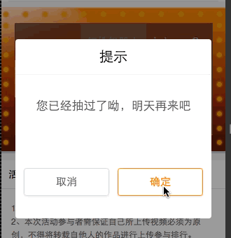
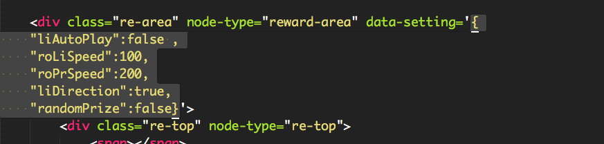

###light-rotate 抽奖轮盘使用指南

----

#### 1.预览效果



#### 2.功能
动态旋转完成抽奖的操作。根据 `ajax` 请求返回的结果显示奖品。

#### 3.说明：
是使用 `jQuery` 开发。

#### 4.使用方法：

**使用方法只能够大致的说一下使用的过程，详细使用请参考示例 Demo **

**4.1** 引入 `js` 目录下的 `index.js` 文件。这里的文件名可以自定义，也可以将其中的代码复制粘贴到自己的代码文件中。

**4.2** 在页面上初始化插件，加入一下代码
```javascript
    $(function() {
        //这里传入动画容器的选择器
        window.LightRotate.init($('[node-type=reward-area]'));
    });

```

**4.3** 自定义动画的参数如下：
```
{
    "liAutoPlay":false ,
    "roLiSpeed":100,
    "roPrSpeed":200,
    "liDirection":true,
    "randomPrize":false
}
```

可以将该自定义参数加入到父级节点上，并且命名为 `data-setting`，可以参考下面的图示


这里也可以不加，直接修改 js 文件的的配置文件，代码如下：

```javascript
    this.setting = {
        liAutoPlay: false, //周围的灯是否自动旋转
        roLiSpeed: 100, //灯旋转的速度ms
        roPrSpeed: 200, //奖品旋转速度ms
        liDirection: true, //旋转方向 true  正方向   false  反方向
        randomPrize: false //空格是否随机选取
    };
```

**4.4** 定义需要做动画的节点

**这一步也是最重要的一步。需要根据自己的 html 选择合适的节点**

如下边我的代码是选择需要做动画的元素(这里可以按照自己的需要自定义选择)

```javascript
    //获取外围的灯
    this.topLight = $('[node-type=re-top]', select).find('span');
    this.rightLight = $('[node-type=re-right]', select).find('span');
    this.bottomLight = $('[node-type=re-bottom]', select).find('span');
    this.leftLight = $('[node-type=re-left]', select).find('span');

    //获取内部的奖品
    this.rowA = $('[node-type=row-a]', select).find('div');
    this.rowB = $('[node-type=row-b]', select).find('div');
    this.rowC = $('[node-type=row-c]', select).find('div');
```

另外在我的代码中也是用了，额外的两个 Dom 节点，

```javascript
    //遮罩奖品的层
    this.rewardLayer = $('[node-type=reward-layer]', select);
    //遮罩按钮的层
    this.coverLayer = $('[node-type=cover_layer]', select);
```

这样基本上就可以跑起来了，如果有什么问题，可以随时和我QQ联系(QQ:1187691302)或者留言反馈。


